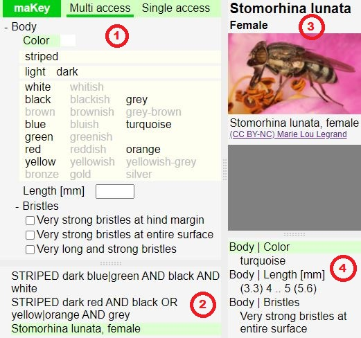

# MultiAccessKey / maKey
A JavaScript framework to create single-access and multi-access keys which allow users to identify biological organisms based on its characteristics.

Keys are created using JavaScript. The keys can be stored and executed on a server or locally. They should be work in various modern web browsers. The framework is tested with Google Chrome.

To try out the framework please create a local copy of the repository and run the file "public/maKey.html". This demo includes an experimental key to some flies.

The file "public/maKeyBasicTest.html" is more suitable to try out the basic functionality of the framework. This key contains only three dummy organisms.

## Using maKey
The following screenshot shows the main screen of maKey with a multi-access key.



The main screen of maKey contains four windows. These windows are marked with red numbers in the screenshot above. For a multi-access key the content of these windows is:  
1. A tree with the available characters and intput fields to specify the character of the organism to be identified 
2. A list with the taxons witch are matching the characters specified above
3. Information about the currently selected character or taxon
4. A description of the characters related to the taxon that was last selected 

For a single-access key the content of these windows differs only slightly:  
1. A window with the current key options and the history of previously chosen options 
   - Every option is specified by a set of characters
   - An option may specify one or multiple taxons as result of the identification process
2. A list with the taxons covered by the single-access key
3. Information about the currently selected character or taxon
4. A description of the characters related to the taxon which is selected in the list of taxons 

## Creating keys
Keys for maKey must be specified in JavaScript files.
The following JavaScript code defines and registers a key with one taxon.

```
MAKey.register('Stomorhina', {
  taxons: {
    'Stomorhina lunata': {
      female: {
        'Body': {
          'Color': 'turquoise',
          'Length [mm]': [3.3, 4, null, 5, 5.6],
          'Bristles': 2
        },
        fig: 10099
      }
    }
  },
  figures: {
    10099: {
      caption: 'Stomorhina lunata, female',
      c: '(CC BY-NC) Marie Lou Legrand',
      source: 'https://www.inaturalist.org/photos/159339502'
    }
  }
});
```
  
You can see the result of this code in the right windows of the screenshot shown above.

Many of the keys available in the literature are single-access keys.
If a single-access key is converted into the maKey input format it can be displayed by maKey as
single-access or multiple-access key.

The following JavaScript code defines and registers a key which can be used as single-access or multiple-access key.

```
MAKey.register('Lucilia', {
  singleAccessKey: {
    1: {
      1: {
        next: 2,
        'Basicostae|Color': ['whitish', {fig: 10199}],
        'Subcostal sclerite|Hairs|Color': ['yellow', {fig: 10101}]
      },
      2: {
        taxon: 'Lucilia (not covered by this key)',
        'Basicostae|Color': 'black|brown',
        'Subcostal sclerite|Hairs|Color': 'black'
      }
    },
    2: {
      1: {
        taxon: 'Lucilia sericata',
        'Palpi|Color': ['orange', '(sometimes darker at tip)']
      },
      2: {
        taxon: 'Lucilia richardsi',
        'Palpi|Color': 'dark brown|blackish']
      }
    }
  }
});
```

## Dependencies
maKey includes a modified version of
- split.js from https://github.com/nathancahill/split/tree/v1.3.5

