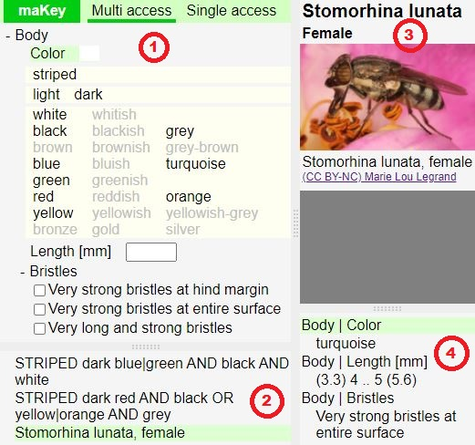

# Creating keys

## Introduction
Keys for maKey must be specified in JavaScript files. Per convention keys shall be stored in the `pulbic/data` folder.

### Single-access keys
Many of the keys available in the literature are single-access keys.
If a single-access key is converted into the maKey input format it can be displayed by maKey as
single-access or multiple-access key.

The following JavaScript code defines and registers a key which can be used as single-access or multiple-access key.
It is a simplified and annotated version of the file `pulbic/data/Lucilia.js`.

```
MAKey.register('Lucilia', {
  singleAccessKey: {
    1: {
      1: {    // Definition of option "Lucilia 1.1"
        next: 2,
        'Basicostae|Color': ['whitish', {fig: 10199}],
        'Subcostal sclerite|Hairs|Color': ['yellow', {fig: 10101}]
      },
      2: {    // Definition of option "Lucilia 1.2"
        taxon: 'Lucilia (not covered by this key)',
        'Basicostae|Color': 'black|brown',
        'Subcostal sclerite|Hairs|Color': 'black'
      }
    },
    2: {
      1: {    // Definition of option "Lucilia 2.1"
        taxon: 'Lucilia sericata',
        'Palpi|Color': ['orange', '(sometimes darker at tip)']
      },
      2: {    // Definition of option "Lucilia 2.2"
        taxon: 'Lucilia richardsi',
        'Palpi|Color': 'dark brown|blackish']
      }
    }
  }
});
```

The code `next: 2` defines a jump to the next question. 
After the user selects the option "Lucilia 1.1" maKey asks the user to choose between option
"Lucilia 2.1" and "Lucilia 2.2".

The code `taxon:` is the keyword to specify the name of a taxon or describe a taxonomic group.

The other parts of the example describe characters to distinguish taxons.
The specification of characters is described below.

### Multi-access keys and supplementary taxon descriptions
The following JavaScript code defines and registers a key with one taxon.
This syntax is primarily suitable to specify characters of a taxon which are not specified as part of
an underlying single-access key.
In addition, the syntax is suitable to specify a multi-access key without supporting a related single-access key.

```
MAKey.register('Stomorhina', {
  taxons: {
    'Stomorhina lunata': {    // The name of a taxon
      'Body': {               // Characters which describe the body of the taxon
        'Length [mm]': [3.3, 4, null, 5, 5.6],
        'Bristles': 2
      },
      female: {               // Characters of females
        'Body|Color': 'turquoise',
        fig: 10099            // A link to a photo of a Stomorhina lunata female
      },
      male: {                 // Characters of males
        'Body|Color': 'blue'
      }
    }
  }
});
```

## Working with characters
Characters are used to distinguish between taxons and taxonomic groups. 
Examples for a colloquial formulation of a character are:
- Body length between 4 and 6 mm.
- The head is red.

The formal parts of a character are:
- A body part (like "head")
- A character category (like "length" or "color" which is is often not explicitly mentioned in a colloquial formulation)
- A value or value range (like "red" or "4 to 6 mm") 

### Defining body parts
Body parts should be defined as globally and universally as possible.
This enables a consistent combination of several partial keys to create a more complex key.

Per convention body parts shall be defined in the `pulbic/data/basicCharacters.js` file.

```
MAKey.bodyParts = {
  main: ['Wings', 'Legs', 'Head', 'Body'],
  'Legs': ['Front legs', 'Mid legs', 'Hind legs'],
  'Head': ['Mouthparts', 'Face', 'Eyes']
};
```

maKey converts this definition to the following tree:
```
 - Wings
 - Legs
    - Front legs
    - Mid legs
    - Hind legs
 - Head
    - Mouthparts
    - Face
    - Eyes
 - Body
```

Insect legs are made up of many parts, and the structure of all legs is very similar.
It is therefore advisable to define the structure of a leg once and
to apply this definition to each leg. JavaScript offers different solutions for this.
A complex but easy to understand solution is shown below:

```
MAKey.bodyPartDefs = {
  legParts: ['Coxa', 'Trochanter', 'Femur', 'Tibia', 'Tarsal segments', 'Claws']
};

MAKey.bodyParts = {
  main: ['Wings', 'Legs', 'Head', 'Body'],
  'Legs': ['Front legs', 'Mid legs', 'Hind legs'],
    'Front legs': MAKey.bodyPartDefs.legParts,
    'Mid legs': MAKey.bodyPartDefs.legParts, 
    'Hind legs': MAKey.bodyPartDefs.legParts,
  'Head': ['Mouthparts', 'Face', 'Eyes']
};
```

### Basic characters
Basic characters are used to define properties like colors.

Basic characters must be declared.
This allows maKey to present a well structured table of available properties.

Per convention basic characters shall be defined in the `pulbic/data/basicCharacters.js` file.
Basic characters must be part of the JavaScript object `MAKey.basicCharacters`.

#### Defining the properties of basic characters
The following JavaScript code shows an abridged version of `MAKey.basicCharacters` with a basic definition of colors.

```
MAKey.basicCharacters = {
  colorModifiers: ['light', 'dark'],
  colors: [
    ['white', 'whitish'],
    ['black', 'blackish', 'grey'],
    ['brown', 'brownish', 'grey-brown'],
    ['blue', 'bluish', 'turquoise'],
    ['green', 'greenish'],
    ['red', 'reddish', 'orange'],
    ['yellow', 'yellowish', 'yellowish-grey'],
    ['bronze', 'gold', 'silver']
  ],
  position: ['laterally'],
  visibility: ['clearly_visible', 'microscopic'],
  pattern: ['striped', 'curled', 'patched'],
};
```

`colorModifiers` defines a JavaScript array with two properties.
`colors` defines a table with many properties. To define a table an array of arrays is used.

Based on this definitions maKey can enable inputs like `bronze`, `light green` or `dark blue`.

The definition of `position`, `visibility`, and `pattern` is used in the following section.

#### Defining an input rule with a combination of basic characters
A combination of basic characters allows complex use cases based on basic characters.
Currently maKey only supports the use of one combination.

The following JavaScript code shows an abridged version of `MAKey.inputRules` with the definition of a combination.

```
MAKey.inputRules = {
  combinations: [
    { singleChoice: 'position visibility',
      multipleChoiceSelector: 'pattern',
      multipleChoice: 'colorModifiers colors'
    }
  ]
};
```

The following screenshot shows the main screen of maKey with the combination defined above.
The combination is marked with the red number 1.
The basic characters `position` and `visibility` are hidden because the key does not use them and maKey only shows characters which are relevant in the current context.



With the help of this definition, the user can describe the stripes of a zebra:
- `striped` with the colors `white`, `light grey` and `black`.

#### Using basic characters to define characters of organisms
Here are some examples to define the body color of an organism within a key.

An organism with a white body:
```
'Body|Color': 'white'
```

The body of this organism can be white, grey or light grey:
```
'Body|Color': 'white|grey|light grey'
```

To describe a striped body a list based on a JavaScript array is used.
The body of the following organism is striped in white and black like the body of some zebras.
```
'Body|Color': ['striped', 'white', 'black']
```

Some zebras have a grey part between the white and the black stripes:
```
'Body|Color': ['striped', 'white', 'grey|light grey|dark grey', 'black']
```

If you try this example, you will see that the multi-access key cannot distinguish the two-colored zebra from the three-colored one.
This is because the two-colored zebra corresponds to an incomplete description of the three-colored zebra.

### Character descriptions
Character descriptions can be used to describe highly specialized characters.
Per convention they shall be stored in the `pulbic/data/characterDescriptions.js` file.
